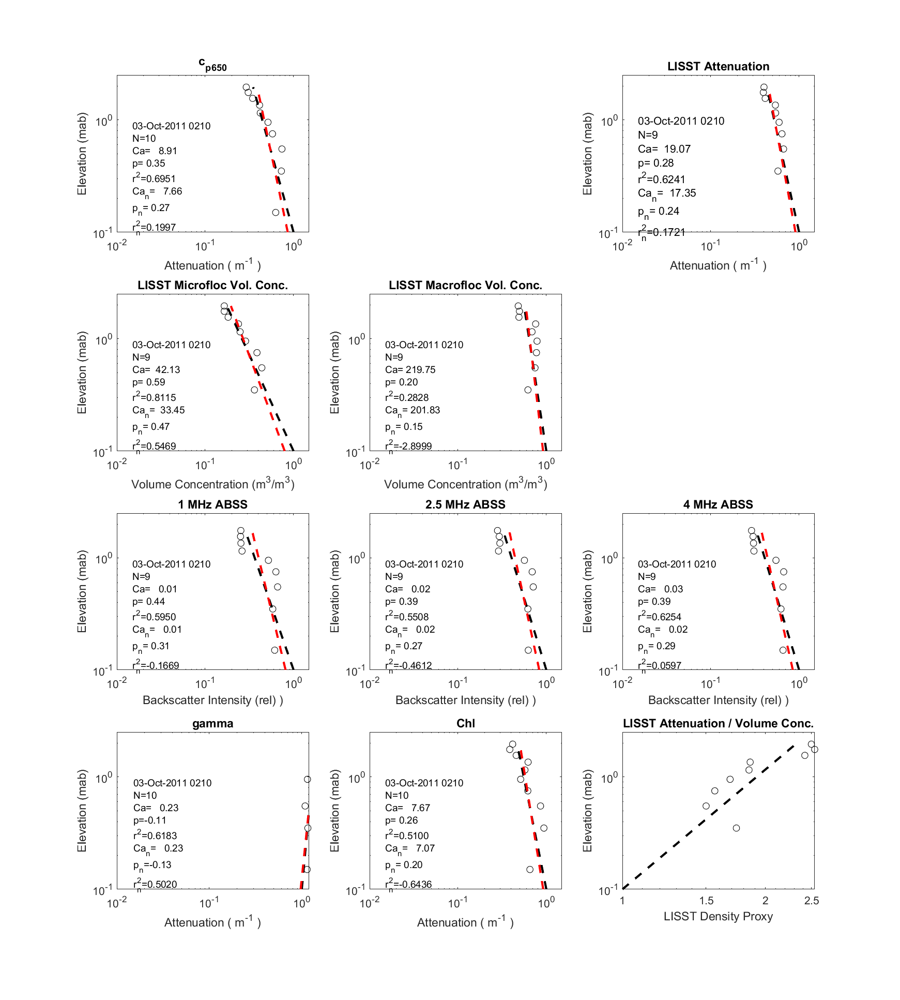

# mvco_optics
Routines, notes, and results for review paper on particle optics.

### Objective

The immediate goal is to extract some example vertical profiles from the MVCO experimental data. In this case, the raw data consists of bin-averaged times, elevations, and instrument responses for instruments on the profiling arm. Ancillary data of time series of flow characteristics are in other data streams.

Right now, I am working on a routine to extract and plot several profiles from specified times. The plan, once the profile plots are reasonably legible, is to look for good examples from times with different flow conditions and particle populations. So far, the results for a random time look like this:




### Data files

This is a list of key, most recent datafiles from the profiler. These reside in the `data_proc` directory, and will be copied into this repo if they are needed for the processing scripts stored her.

* `advpr_mvco11_05-Jan-2012.mat` - Processed ADV pair data, with velocities, wave parameters, and stresses
* `puv_proc_green_30-Dec-2011.mat` - Current, wave, and Madsen 94 model results from green ADV
* `_pfa.mat` files are time series of profile fit parameters (not saved in this repo)
* `suspsed_ba20_20rstrim_crs_cen.mat` - Profile data structure for all instruments after bin averaging. This is the starting dataset for this repo, and has two structures (`ba` for bin-averaged, and `va` for variance) with fields like this:
```
ba = 
  struct with fields of arrays with dimensions [vertical bins x time]:

          ADVzc: [12×2441 double]
          ADVtc: [12×2441 double]
          OBSzc: [12×2441 double]
          OBStc: [12×2441 double]
        transzc: [12×2441 double]
        transtc: [12×2441 double]
         ADVagc: [12×2441 double]
            OBS: [12×2441 double]
       tranattn: [12×2441 double]
              u: [12×2441 double]
              v: [12×2441 double]
          ADVdn: [12×2441 double]
          OBSdn: [12×2441 double]
         trandn: [12×2441 double]
           ADVz: [12×2441 double]
           OBSz: [12×2441 double]
          tranz: [12×2441 double]
          ADVbe: [1×13 double]
      ADVfields: {13×1 cell}
      LISSTattn: [12×2442 double]
      LISSTD16v: [12×2442 double]
      LISSTD50v: [12×2442 double]
      LISSTD84v: [12×2442 double]
       LISSTsvv: [12×2442 double]
     LISSTSzmnv: [12×2442 double]
      LISSTvtot: [12×2442 double]
      LISSTD16a: [12×2442 double]
      LISSTD50a: [12×2442 double]
      LISSTD84a: [12×2442 double]
       LISSTsva: [12×2442 double]
     LISSTSzmna: [12×2442 double]
      LISSTatot: [12×2442 double]
    LISSTfinesv: [12×2442 double]
    LISSTmicrov: [12×2442 double]
    LISSTmacrov: [12×2442 double]
    LISSTfinesa: [12×2442 double]
    LISSTmicroa: [12×2442 double]
    LISSTmacroa: [12×2442 double]
     LISSTvconc: [12×2442×32 double]
     LISSTaconc: [12×2442×32 double]
        LISSTsz: [32×1 double]
        LISSTdn: [12×2442 double]
         LISSTz: [12×2442 double]
        LISSTzc: [12×2442 double]
        LISSTtc: [12×2442 double]
        LISSTbe: [1×13 double]
    LISSTfields: {28×1 cell}
    
    ...and many more
```

### Processing scripts

Important processing scripts that have not been copied into this repo are:

* `bin_ave_var_suspsed_insts.m` - Bin averages raw data (as posted in data release) to make profile .mat files (e.g., `suspsed_ba_20_20rstrim_crs_cen.mat`). The number (e.g., 20) indicates the minutes for bin-average...20 = 1 profile, 40 = 2 profiles, 80 = 3 profiles. The `var` here indicates that variance results are also produced. `cen` in the output file name means that bin centers are included for some (but not all) of the instruments. (Why not all? Might need to look back at this.)

* `plot_pfa_ts.m` - prepares data for `fdyn.m`
  * Loads the time series data `ustar_av.mat` created by `plot_ustar.m`
  * Loads LISST size bins from `lisst_av`
  * Loads a bunch of `*_pfa.mat` files
  * Interpolates the results onto the u* time base, then onto two-hour time base

* `fdyn.m` - various time series plots of floc parameters

Scripts included in this repo are:

* `ws_fit_mo.m` - Fits Rouse profiles to profile data (e.g., `suspsed_ba20_20rstrim_crs_cen.mat`) using both linear and non-linear fitting routines. The `mo` suffix indicates this file has been derived from un-prefixed version in `data_proc` directory.

* `p_fit_times_mo.m` - Derivative of `ws_fit_mo.m` restructured to produce profiles of many instruments for one time period. This is still a work in progress. It calls fitting routines `pfit.m` and `pfit_nlp.m`, which require `lsfit.m`


